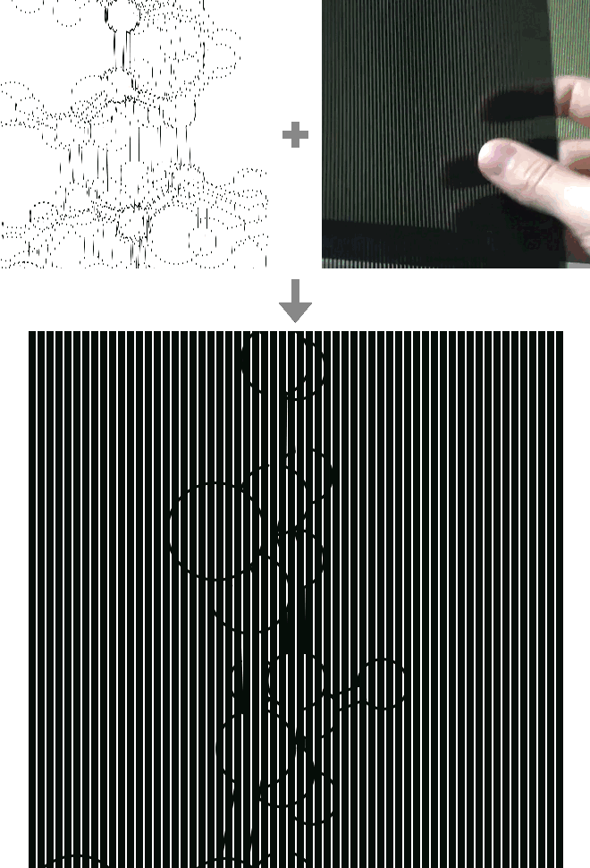
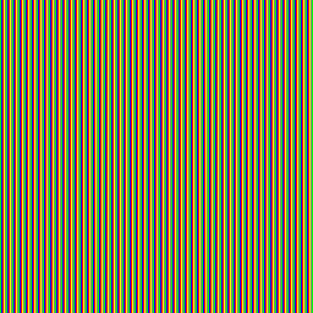
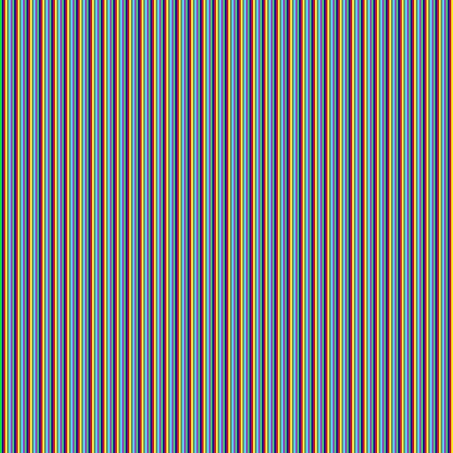
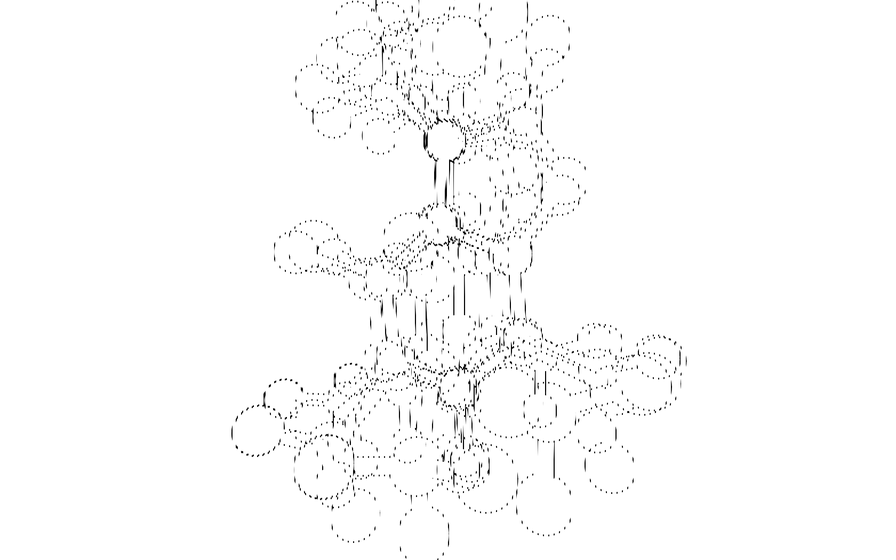

[](https://goreportcard.com/report/github.com/hashier/1-2-animation)

# 1-2-animation

Generates Poemotion images (also known as [barrier-grid animations](https://en.wikipedia.org/wiki/Barrier-grid_animation_and_stereography)): still pictures that start to move when you slide a striped sheet over them.



## How it works

The tool takes a few animation frames, cuts them into thin vertical strips and interleaves them into one scrambled-looking image (top left). The mask (top right) is a real plastic sheet with black stripes and narrow clear slits. Lay it over the image on a screen or a printout and each slit shows a strip of one frame only. Slide the sheet sideways and the frames play one after another, as in the animation above.

See it in real life in the [demo video](https://youtu.be/wS_h5yDLNzM), or watch [what Poemotion books look like](https://www.youtube.com/watch?v=Serhd00QNzo).

## Install

```sh
go install github.com/hashier/1-2-animation@latest
```

## Usage

Pass at least two input images of the same size, one per animation frame:

```sh
1-2-animation -o out.png frame1.png frame2.png frame3.png frame4.png frame5.png
```

| Flag | Default | Description |
|---|---|---|
| `-o <file>` | `out.png` | Output PNG. |
| `-ppf <n>` | `2` | Pixels taken from each frame in turn, which is the width of the slit in your mask. |
| `-example` | off | Write two colored test images (5 and 7 frames). They help to find out how many frames your mask is made for. |
| `-calibrate <file>` | off | Write a calibration image. It helps to find out how many pixels wide the slit of your mask is. |
| `-f <n>` | `5` | Number of frames. Only used for the example images. |
| `-w <n>`, `-h <n>` | `1680`, `1050` | Image size. Only used for the calibration and example images. |
| `-cp`, `-mp` | off | Write a CPU profile to `cpu.prof` or a memory profile to `mem.prof`. |

### Matching your mask

The image only animates if it fits the mask you have, so find out two numbers first:

1. **Slit width**: use the calibration image from `-calibrate <file>`.
2. **Number of frames**: use the test images from `-example`.

Show the result at its native size. An image viewer that enlarges or shrinks the picture to fit the window changes the strip width, and the effect is gone.

## Examples

Five and seven frame color test images, made with `-example`:




A rotating molecule in five frames. The frames were drawn with [`example/molecule/graph.go`](example/molecule/graph.go):



## Documentation

[pkg.go.dev](https://pkg.go.dev/github.com/hashier/1-2-animation)

## License

GPL-3.0, see [LICENSE](LICENSE).
